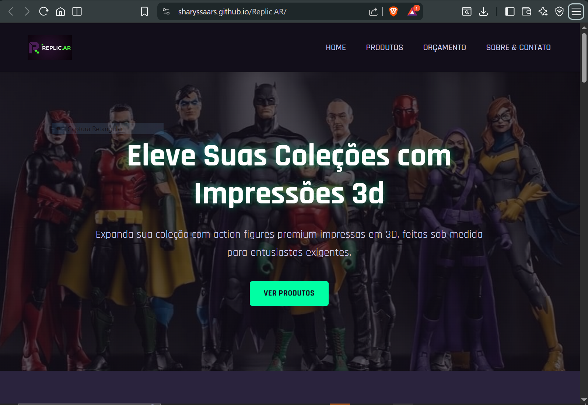

<div align="center">
   
   <h1>Replic.AR - Action Figures 3D</h1>
   
   <p>
      <strong>Link do Projeto (GitHub Pages):</strong><br>
      <a href="#">[LINK_DO_SEU_GITHUB_PAGES_AQUI]</a>
   </p>
</div>

---

## Acesso ao Site

Aqui você pode conferir o projeto publicado e funcional:

* **Link do GitHub Pages:** [https://sharyssaars.github.io/Replic.AR/]
* **Data de Publicação:** 24/11/2025

<div align="center">
   
</div>

---

## Integrantes e Papéis

* **Sharyssa Araujo** - UC25104132:
    * UX Designer (Prototipagem e Identidade Visual)
    * Desenvolvedora Front-End (HTML, CSS, JavaScript)

---

## Sobre o Projeto

Este é o repositório do site institucional e e-commerce da **Replic.AR**, uma startup fictícia focada na criação e venda de action figures personalizadas e colecionáveis, produzidas com tecnologia de impressão 3D.

### Descrição do Negócio
O mercado de colecionáveis está em constante crescimento. A Replic.AR se diferencia ao unir essa paixão com o poder da manufatura aditiva (impressão 3D), oferecendo um nível de personalização que a produção em massa não permite. O modelo de impressão sob demanda também reduz custos de estoque e permite um catálogo de produtos virtualmente infinito.

* **Objetivo:** Desenvolver uma plataforma web atraente e funcional onde os clientes possam comprar itens de coleções pré-definidas (Linhas CORE, PRO e APEX) e solicitar orçamentos para peças 100% personalizadas.
* **Público-Alvo:** Colecionadores, jogadores de RPG e entusiastas da cultura pop (geek/gamer).

---

## Resumo das Etapas do Projeto

O desenvolvimento foi dividido em três partes estratégicas:

### Parte 1: Estruturação e Planejamento
Foco na definição do negócio e estruturação.
* Criação do wireframe de baixa e alta fidelidade.
* Definição de paleta de cores e tipografia.
* Estruturação do HTML semântico base.

### Parte 2: Estilização e Responsividade
Implementação do CSS para dar vida ao design.
* Aplicação do conceito **Mobile First**.
* Uso de **Flexbox** e **Grid** para layouts complexos.
* Ajustes de media queries para tablets e desktops.

### Parte 3: Interatividade e Refinamento
Adição de JavaScript e melhorias de código.
* **Modularização:** Uso de `fetch` para carregar Header e Footer dinamicamente.
* **Acessibilidade:** Correção de contrastes e navegação por teclado.
* **JS Funcional:** Menu hambúrguer e validação de formulários.

---

### Decisões de Design (Identidade Visual)

| Elemento | Escolha | Justificativa |
| :--- | :--- | :--- |
| **Fonte** | `Rajdhani` | Sans-serif geométrica que remete à tecnologia e futurismo. |
| **Cor Fundo** | `#120E1A` (Roxo Abissal) | Tom escuro "Dark Mode", ideal para o público gamer e para destacar produtos. |
| **Cor Destaque** | `#00FFA3` (Verde Cyber) | Cor vibrante de energia, usada em botões e chamadas para ação. |
| **Layout** | Mobile First | Foco na experiência em dispositivos móveis, com menu hambúrguer e grids adaptáveis. |

---

## Tecnologias Utilizadas

* **HTML5:** Estruturação semântica do conteúdo.
* **CSS3:** Estilização, Flexbox, Grid Layout, Variáveis (`:root`) e Media Queries.
* **JavaScript (ES6+):** Manipulação do DOM, `fetch` API para componentes e validação de formulários.
* **Git/GitHub:** Versionamento de código.

---

## Estrutura de Pastas

O projeto segue uma organização clara para facilitar a manutenção e escalabilidade:

```text
/ProjetoIntegrador-Replic.AR
│
├── index.html          # Página Inicial / Home
├── produtos.html       # Página de coleções e produtos
├── orcamento.html      # Formulário para encomendas personalizadas
├── sobre.html          # Página institucional e contato
│
├── css/
│   └── style.css       # Folha de estilos principal (variáveis, layout, reset)
│
├── js/
│   ├── script.js       # Lógica principal (menu, validações)
│   ├── componentes.js  # Script para carregar header/footer dinamicamente
│   └── componentes/    # Pasta com fragmentos de HTML reutilizáveis
│       ├── header.html
│       └── footer.html
│
├── img/                # Imagens do projeto (otimizadas)
│   ├── LogoMarca.png
│   ├── hero-background.jpg
│   └── ...
│
└── README.md           # Documentação do projeto

   Otimizações e Testes
Otimizações Realizadas
Componentização: O Header e Footer não são repetidos em cada arquivo HTML, mas carregados via JavaScript, facilitando a manutenção.

SEO: Adição de meta tags de descrição e keywords em todas as páginas.

Imagens: Uso de object-fit e width: 100% para garantir fluidez sem distorção.

Testes de Compatibilidade
O site foi testado e validado nos seguintes cenários:

Navegadores: Google Chrome, Mozilla Firefox e Microsoft Edge.

Dispositivos:

Mobile (375px - iPhone SE/X)

Tablet (768px - iPad Mini)

Desktop (1366px e 1920px)

   Reflexões e Aprendizados
Reflexão Individual (Sharyssa)
Aprendizados Técnicos: Desenvolvi uma compreensão sólida de Grid Layout e Flexbox para criar layouts responsivos complexos. A maior curva de aprendizado foi entender a DOM Manipulation com JavaScript e como usar a Fetch API para modularizar os componentes HTML, algo que elevou o nível técnico do projeto.

Aprendizados de Processo: Atuar como Designer e Desenvolvedora exigiu muita organização. O desafio foi equilibrar a criatividade do Figma com a viabilidade técnica do código. Organizei as tarefas por etapas (Estrutura -> Estilo -> Comportamento), o que evitou retrabalho.

Desafios Enfrentados: O maior desafio foi fazer o Menu Hambúrguer funcionar corretamente junto com o carregamento assíncrono do Header. Superei isso estudando sobre async/await e garantindo que o script do menu só rodasse após o header ser injetado na página. Se pudesse voltar no tempo, teria começado a modularização desde o início do projeto.

Reflexão do Projeto (Evolução e Feedbacks)
Evolução: O projeto começou como páginas estáticas simples e evoluiu para uma aplicação web modular e interativa. A maior melhoria foi a implementação da identidade visual "Dark/Gamer" e a validação de formulários, que tornou o site profissional.

Feedbacks Recebidos (Simulação de Avaliação):

"As imagens dos produtos estavam esticadas em telas grandes." -> Ação: Corrigimos aplicando object-fit: cover e ajustando o Grid.

"O menu ocupava muito espaço no celular." -> Ação: Implementação do menu hambúrguer retrátil.

"Faltava feedback ao enviar o formulário." -> Ação: Adicionamos validação JS com alertas visuais de erro/sucesso.

Relevância para o Negócio: O site agrega valor real ao centralizar o portfólio e profissionalizar o processo de orçamento, que antes seria manual. Apresentaríamos ao dono como uma ferramenta de automação de vendas e vitrine global. Sim, usaríamos como portfólio pois demonstra domínio de HTML/CSS/JS sem dependência de frameworks.

   Próximos Passos e Melhorias Futuras
Melhorias Técnicas Planejadas
[ ] Otimizar todas as imagens para formato WebP para performance.

[ ] Melhorar a acessibilidade adicionando atributos ARIA dinâmicos no menu.

[ ] Implementar um Carrossel de Imagens (Slider) na página inicial com JavaScript.

[ ] Criar um Backend real (Node.js ou PHP) para envio de e-mails.

Conhecimentos a Aprofundar
React.js: Para transformar os componentes HTML em componentes funcionais reais.

Acessibilidade WCAG: Aprofundar em navegação por voz e leitores de tela.

Animações CSS Avançadas: Para criar micro-interações mais fluidas nos cards.

Aplicação Futura
Este projeto serviu como base sólida de JavaScript "Vanilla". Nas próximas disciplinas de Front-End Frameworks, usarei a lógica de componentes aprendida aqui para facilitar a transição para React ou Vue.

   Créditos
Fontes: Rajdhani via Google Fonts.

Ícones: Elementos visuais criados via CSS e caracteres Unicode.

Imagens: Imagens de produtos utilizadas para fins educacionais (mockups de Action Figures de terceiros).

<div align="center"> <sub>Desenvolvido por Sharyssa Araujo para o Projeto Integrador.</sub> </div>